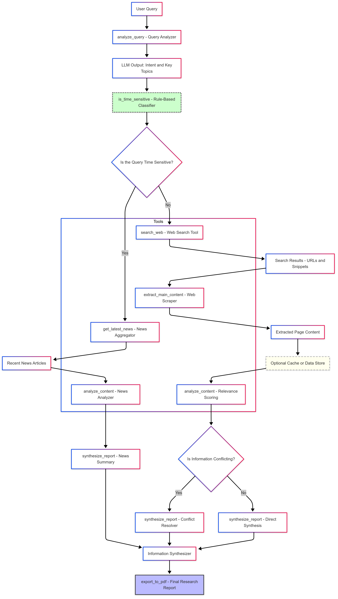

# Web Research Agent

## Overview

The Web Research Agent is a comprehensive tool designed to analyze user queries, search the web, extract and analyze content, synthesize information, and generate reports in PDF format. It integrates various modular components to provide a seamless experience for users seeking to gather and synthesize information from the web.

## 🔥 Hosted URL

👉 [Click Here to Try the App!](https://ai-agent-h5h7.onrender.com/)
git

## Features

- **Query Analyzer**: Detects query intent, extracts keywords, and identifies time-sensitive queries.
- **Web Search Tool**: Searches the web for relevant information.
- **Web Scraper**: Extracts main content from web pages.
- **Content Analyzer**: Analyzes extracted content for relevance and structure.
- **Information Synthesizer**: Summarizes information from multiple sources, resolving conflicts.
- **News Aggregator**: Fetches the latest related news articles.
- **PDF Exporter**: Generates PDF reports.
- **Caching Module**: Saves and loads query results to improve performance.

## Installation

1. Clone the repository:
   ```bash
   git clone https://github.com/Ashish94312/ai_agent.git
   cd ai_agent
   ```

2. Install dependencies:
   ```bash
   pip install -r requirements.txt
   ```

3. Set up environment variables in a `.env` file:
   ```
   OPENAI_API_KEY=your_openai_api_key
   SERPAPI_API_KEY=your_serpapi_api_key
   NEWSAPI_KEY=your_newsapi_key
   ```

## Usage

Run the main script:
```bash
python main.py
```
Follow the prompts to enter a query and receive a synthesized report.

## Testing

Comprehensive tests are included for each component. Run them with:
```bash
pytest tests/
```

## Workflow

The workflow of the Web Research Agent:



## Components Overview

Each component is responsible for a specific task:

- **Query Analyzer**: Uses OpenAI to detect query intent, extract keywords, and recognize time-sensitive queries.
- **Web Search Tool**: Searches the web via SERPAPI.
- **Web Scraper**: Extracts main content using BeautifulSoup and Newspaper3k.
- **Content Analyzer**: Evaluates content relevance and structure.
- **Information Synthesizer**: Summarizes and reconciles multiple sources.
- **News Aggregator**: Fetches up-to-date news using NewsAPI.
- **PDF Exporter**: Generates reports in PDF format with FPDF.
- **Caching Module**: Stores query results for faster future access.

## ✅ **Test Coverage**

The Web Research Agent is thoroughly tested:

### 🧠 Query Analyzer (`analyze_query`)
- Intent detection (Informational, How-to, News)
- Keyword extraction
- Time sensitivity recognition

### 🔍 Web Search Tool (`search_web`)
- Structured search result validation
- Handling fewer-than-expected results
- Graceful handling of missing API keys

### 🌐 Web Scraper (`extract_main_content`)
- Content extraction from valid URLs
- Robustness against short/invalid content and unreachable URLs

### 📑 Content Analyzer (`analyze_content`)
- Keyword relevance detection
- Recognition of structured content (headings, lists)
- Handling insufficient or irrelevant content

### 🧾 Information Synthesizer (`synthesize_report`)
- Summarization across multiple sources
- Conflict detection and resolution
- Graceful handling of no available content

### 📰 News Aggregator (`get_latest_news`)
- Fetching recent news articles
- Time-sensitive query integration

### 📄 PDF Exporter (`export_to_pdf`)
- PDF generation from synthesized information

### 🗃️ Caching Module (`cache.py`)
- Saving and loading of cached queries (verified manually)

## Prompt and Instruction Design

Prompts and instructions are designed for:

- **Clarity**: Minimizing ambiguity in AI tasks.
- **Contextual Awareness**: Adapting to time-sensitive and topic-specific queries.
- **Flexibility**: Supporting various query types (informational, how-to, news).

## Integration with External Tools

The agent integrates with:

- **OpenAI API**: For NLP tasks.
- **SERPAPI**: For web searches.
- **NewsAPI**: For fetching news.

API keys are securely managed via environment variables, and integrations are modular for easy updates.

## Error Handling and Resilience

The agent is built to handle unexpected issues smoothly:

- **API Failures**: Handles missing API keys gracefully.
- **Invalid URLs**: Web Scraper skips unreachable links without crashing.
- **Insufficient Content**: Content Analyzer adjusts strategies dynamically.
- **Missing NLTK Resources**: Clear user instructions to resolve.
- **Caching**: Enhances reliability and performance by reducing redundant processing.


## Challenges

- Render file issues → Solved with in-memory PDF generation (BytesIO).

- Slow scraping → Solved using ThreadPoolExecutor for parallel scraping.

- OpenAI API latency and cost → Solved by switching to gpt-3.5-turbo.

- SerpAPI extra results → Solved by flexible result filtering and test updates.

- Flask variable crash → Solved by initializing variables before rendering.

- Strict testing assumptions → Solved by adapting tests to check keywords matched.